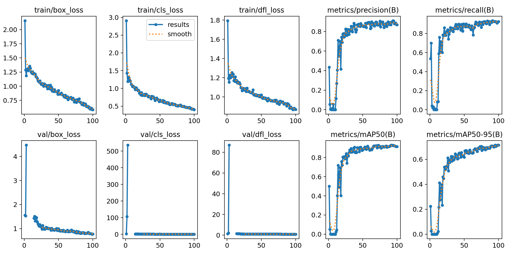
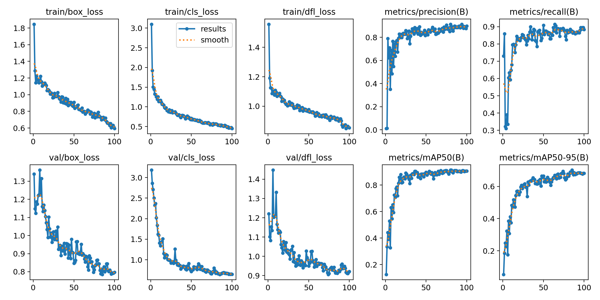
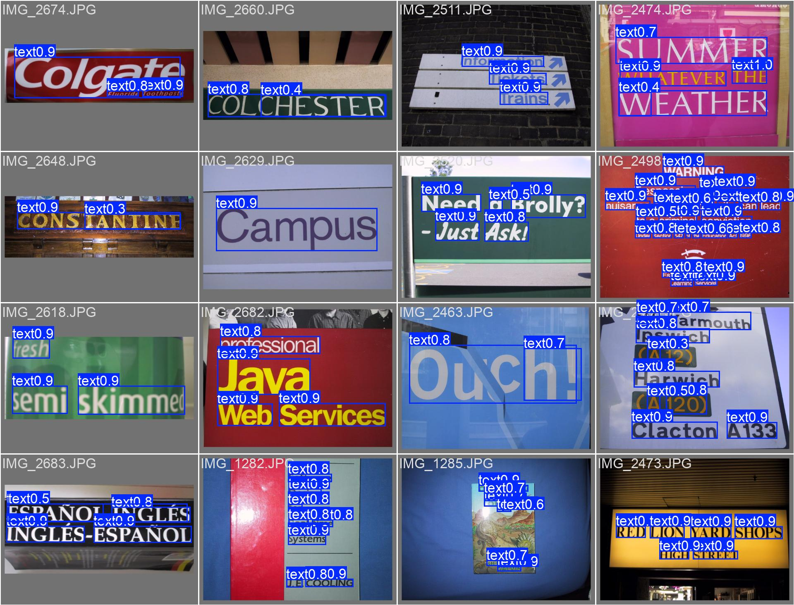
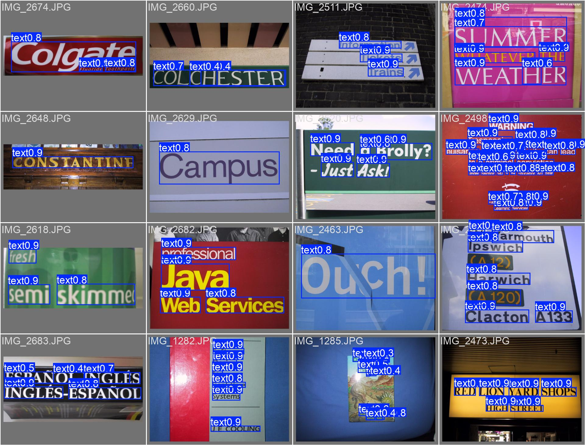
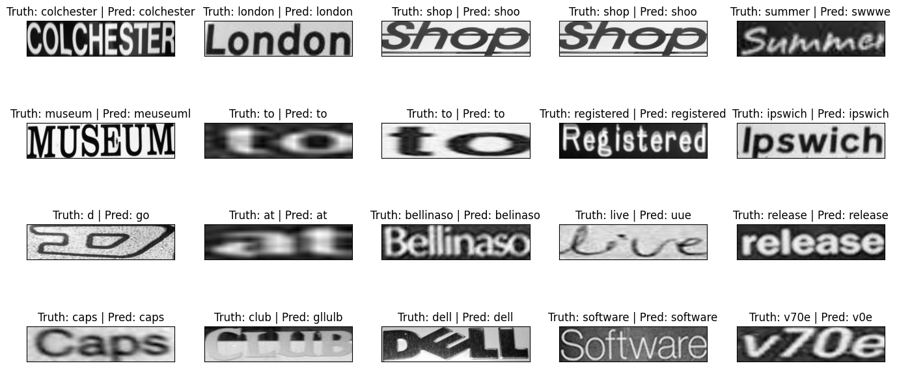
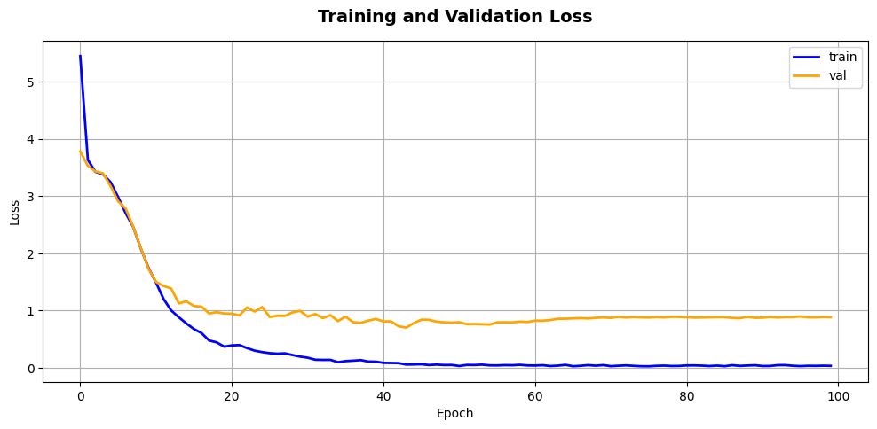
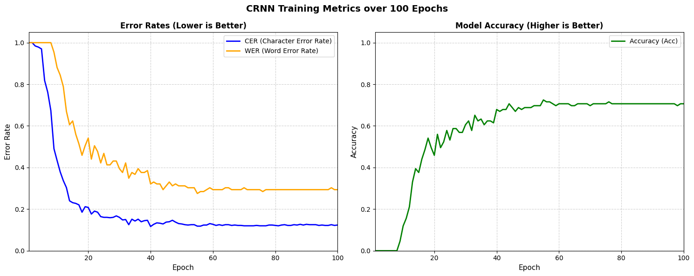
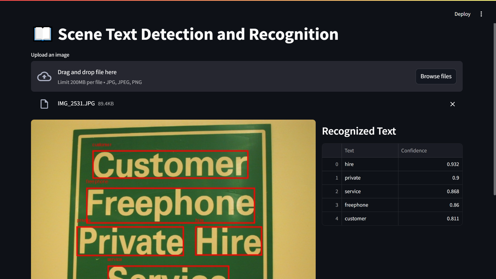

# 📖 Scene Text Detection and Recognition using YOLOv11m and CRNN

<p align="center">


</p>

<p align="center">
An end-to-end Optical Character Recognition (OCR) system that combines <b>YOLOv11m</b> for scene text detection and a <b>CRNN (ResNet34 + Bidirectional GRU)</b> model for text recognition, deployed through <b>FastAPI</b> and an interactive <b>Streamlit</b> interface.
</p>

## 📌 Overview

Reading text from natural scene images is considerably more challenging than recognizing printed documents due to varying fonts, lighting conditions, viewing angles, backgrounds, occlusions, and text orientations.

This project presents a complete **Scene Text Detection and Recognition** pipeline capable of locating text regions in an image and converting them into machine-readable text.

The proposed OCR pipeline consists of two independent deep learning models:

- **YOLOv11m** for detecting word-level text regions
- **CRNN (Convolutional Recurrent Neural Network)** with a **ResNet34 backbone** and **Bidirectional GRU** for recognizing cropped text images

The system has been trained and evaluated using the **ICDAR 2003 Robust Reading Dataset**. In addition to model development, the project also provides:

- RESTful inference API using **FastAPI**
- Interactive web application using **Streamlit**
- Modular architecture for future extension
- End-to-end OCR inference pipeline

## 🖼️ OCR Pipeline

```text
                 Input Image
                      │
                      ▼
             YOLOv11m Detector
                      │
                      ▼
        Word-level Bounding Boxes
                      │
                      ▼
             Crop Text Regions
                      │
                      ▼
     CRNN (ResNet34 + BiGRU + CTC)
                      │
                      ▼
            Recognized Text Strings
                      │
                      ▼
          FastAPI JSON Response
                      │
                      ▼
             Streamlit Web UI
```

## 🎯 Project Objectives

The primary objectives of this project are:

- Develop a robust scene text detector using YOLOv11m.
- Build an accurate text recognizer based on CRNN.
- Design an end-to-end OCR pipeline integrating both models.
- Deploy the OCR system as a RESTful API.
- Build an intuitive web interface for interactive inference.
- Provide a modular codebase suitable for future research and production deployment.

## ✨ Key Highlights

- 🔍 Word-level text detection using **YOLOv11m**
- 🔠 Text recognition using **CRNN (ResNet34 + Bidirectional GRU)**
- 📚 Character-level decoding with **Connectionist Temporal Classification (CTC)**
- 🚀 Fast inference pipeline using FastAPI
- 💻 User-friendly web interface built with Streamlit
- 🧩 Modular architecture separating detection, recognition, and deployment
- ⚡ GPU acceleration with PyTorch
- 📊 Comprehensive evaluation using Precision, Recall, mAP, CER, WER, and Accuracy

# ✨ Features

This repository provides a complete end-to-end OCR framework for detecting and recognizing scene text from natural images.

## 🔍 Scene Text Detection

- YOLOv11m-based text detector
- Word-level localization
- High recall on ICDAR2003
- Robust against varying text sizes
- Fast GPU inference
- Confidence score for every prediction

## 🔠 Scene Text Recognition

- CRNN architecture
- ResNet34 feature extractor
- Bidirectional GRU sequence modeling
- CTC-based transcription
- Character-level decoding
- Supports variable-length text recognition

## 🧠 Deep Learning Pipeline

The OCR pipeline automatically performs:

1. Detect text regions
2. Crop detected words
3. Preprocess cropped images
4. Extract visual features
5. Predict character sequences
6. Decode CTC outputs
7. Return recognized text

## 🚀 REST API

The project includes a production-ready FastAPI backend.

Available endpoints include:

| Endpoint | Description |
|-----------|-------------|
| `/health` | API health check |
| `/predict` | OCR inference |

The API returns predictions in JSON format:

```json
{
    "predictions": [
        {
            "bbox": [34, 65, 180, 110],
            "class_name": "text",
            "confidence": 0.94,
            "text": "openai"
        }
    ]
}
```

## 💻 Interactive Web Application

A Streamlit interface is provided for quick experimentation.

Users can:

- Upload images
- Perform OCR with one click
- Visualize detected bounding boxes
- Display recognized text
- View confidence scores
- Inspect prediction results in tabular format

## 📊 Model Evaluation

Detection performance is evaluated using:

- Precision
- Recall
- mAP@50
- mAP@50–95

Recognition performance is evaluated using:

- Accuracy
- Character Error Rate (CER)
- Word Error Rate (WER)
- CTC Loss

## 🏗️ Modular Architecture

The project separates different responsibilities into independent modules.

- Detection
- Recognition
- OCR Pipeline
- API
- UI
- Configuration
- Utilities

This design makes the repository easy to maintain, extend, and deploy.

## ⚡ Performance

- GPU-accelerated inference using PyTorch
- Batch processing support during training
- Automatic learning rate scheduling
- Gradient clipping for stable optimization
- Transfer learning with pretrained ResNet34 and YOLOv11

## 🔮 Future Extension

The modular design allows easy integration of:

- Transformer-based OCR models
- Vision Transformers
- Attention-based decoders
- ONNX inference
- TensorRT optimization
- Docker deployment
- Cloud deployment
- Multi-language OCR

# 🏗️ System Architecture

The proposed OCR framework follows a two-stage pipeline consisting of **text detection** and **text recognition**. Instead of recognizing text directly from the entire image, the system first detects individual text regions and then transcribes each cropped region independently. This modular design improves recognition accuracy and allows each component to be optimized separately.

```text
                              Input Image
                                   │
                                   ▼
                      ┌────────────────────────┐
                      │     YOLOv11m Detector  │
                      └────────────────────────┘
                                   │
                        Detect text bounding boxes
                                   │
                                   ▼
                    ┌────────────────────────────┐
                    │ Crop Detected Text Regions │
                    └────────────────────────────┘
                                   │
                     Each cropped word image
                                   │
                                   ▼
                 ┌───────────────────────────────┐
                 │ Image Preprocessing Pipeline  │
                 │                               │
                 │ Resize                        │
                 │ Grayscale                     │
                 │ Normalize                     │
                 └───────────────────────────────┘
                                   │
                                   ▼
                ┌────────────────────────────────┐
                │ CRNN (ResNet34 + BiGRU + CTC)  │
                └────────────────────────────────┘
                                   │
                    Character probability sequence
                                   │
                                   ▼
                         CTC Greedy Decoding
                                   │
                                   ▼
                       Recognized Text Strings
                                   │
                                   ▼
                    FastAPI REST API Response
                                   │
                                   ▼
                      Streamlit Visualization
```

## 🔍 Stage 1 – Scene Text Detection

The first stage is responsible for locating all text regions in an input image.

A pretrained **YOLOv11m** object detector is fine-tuned on the ICDAR2003 dataset using word-level annotations extracted from XML files. The detector predicts bounding boxes surrounding each text instance together with a confidence score.

Output:

- Bounding box coordinates
- Object class
- Confidence score

These detected regions are subsequently cropped and passed to the recognition model.

## 🔠 Stage 2 – Scene Text Recognition

Each cropped text image is processed independently by a **Convolutional Recurrent Neural Network (CRNN)**.

The recognizer consists of three main components:

### Feature Extraction

A pretrained **ResNet34** backbone extracts high-level visual features from the cropped text image.

Instead of performing image classification, the final classification layers are removed, allowing the backbone to generate feature maps suitable for sequence modeling.

### Sequence Modeling

The extracted feature maps are converted into sequential feature vectors and processed using a **Bidirectional GRU**.

The recurrent network captures contextual dependencies from both left-to-right and right-to-left directions, enabling better recognition of characters within words.

### Transcription

Finally, a fully connected layer predicts the probability distribution of every character at each time step.

The output sequence is decoded using **Connectionist Temporal Classification (CTC)**, which removes repeated characters and blank tokens without requiring character-level alignment during training.

## 🌐 Deployment Architecture

The inference system is deployed using a lightweight client-server architecture.

```text
                 User
                  │
                  ▼
          Streamlit Web UI
                  │
        HTTP POST /predict
                  │
                  ▼
           FastAPI Backend
                  │
         OCR Processing Pipeline
                  │
      ┌───────────┴───────────┐
      ▼                       ▼
YOLOv11m Detector      CRNN Recognizer
      │                       │
      └───────────┬───────────┘
                  ▼
          JSON Prediction Result
                  │
                  ▼
          Streamlit Visualization
```

This architecture separates the user interface from the inference engine, making the project easier to maintain and suitable for future deployment on cloud platforms.

# 📂 Project Structure

The repository is organized into independent modules following a modular software architecture. Each component is responsible for a single task, making the project easier to maintain, debug, and extend.

```text
scene_text_detection_and_recognition/
|
|── Datasets/
│
├── Models/
│   ├── best_yolo11m.pt
│   └── crnn_resnet34_gru.pth
│
├── Notebooks/
│   ├── Text_Detection.ipynb
│   └── Text_Recognition.ipynb
│
├── reports/
│   ├── figures/
│   ├── evaluation/
│   ├── predictions/
│   └── training_curves/
│
├── src/
│   │
│   ├── api/
│   │   ├── main.py
│   │   ├── routes.py
│   │   └── schemas.py
│   │
│   ├── config/
│   │   └── settings.py
│   │
│   └── models/
│       ├── architectures/
│       │   └── crnn.py
│       │
│       ├── detector.py
│       ├── recognizer.py
│       └── pipeline.py
│
├── utils/
│   ├── tokenizer.py
│   └── ...
│
├── app.py
├── requirements.txt
└── README.md
```

## Datasets

Store the ICDAR 2003 Dataset which is used for training YOLOV11 and CNRR.

This directory also stores the preprocessed data for training YOLOV11 and CNRR

## 📁 Models

The **Models** directory stores pretrained weights used during inference.

| File | Description |
|-------|-------------|
| `best_yolo11m.pt` | Fine-tuned YOLOv11m detector |
| `crnn_resnet34_gru.pth` | Trained CRNN recognition model |

## 📁 Notebooks

Contains Jupyter notebooks used during model development.

Typical notebooks include:

- Dataset preprocessing
- YOLO training
- CRNN training
- Evaluation
- Visualization

Keeping experimentation separate from deployment code improves project organization.

## 📁 reports

Stores training artifacts and evaluation results.

Examples include:

- Loss curves
- Precision-Recall curves
- Validation predictions
- Confusion matrices
- Performance tables
- Figures used in reports or publications

## 📁 src

The **src** directory contains all source code used during inference.

The codebase is divided into independent modules following good software engineering practices.

### api/

Implements the REST API using **FastAPI**.

| File | Responsibility |
|------|----------------|
| `main.py` | Creates the FastAPI application |
| `routes.py` | Defines API endpoints |
| `schemas.py` | Defines request and response models |

### config/

Stores project configuration.

Typical settings include:

- Model paths
- Device selection
- Hyperparameters
- Image preprocessing pipeline

Centralizing configuration avoids hardcoding values throughout the project.

### models/

Implements the core OCR pipeline.

#### architectures/

Contains neural network architectures.

Current implementation:

- CRNN

Future models can easily be added without affecting the remaining code.

#### detector.py

Loads the trained YOLOv11m model and performs scene text detection.

Responsibilities:

- Load detector weights
- Run inference
- Extract bounding boxes
- Return confidence scores

#### recognizer.py

Loads the trained CRNN model and predicts text from cropped word images.

Responsibilities:

- Image preprocessing
- Feature extraction
- Sequence prediction
- CTC decoding

#### pipeline.py

Acts as the bridge between detection and recognition.

Workflow:

1. Receive input image
2. Detect text regions
3. Crop each detected word
4. Recognize text
5. Aggregate predictions
6. Return structured results

This design keeps the OCR pipeline modular and reusable.

## 📁 utils

Contains utility functions shared across the project.

Current utilities include:

- Character encoding
- Character decoding
- CTC decoding
- Tokenization

Separating these utilities avoids duplicated code and simplifies maintenance.

## 📄 app.py

Implements the Streamlit application.

Main responsibilities:

- Upload images
- Send requests to FastAPI
- Display detected bounding boxes
- Visualize recognized text
- Present confidence scores

## 📄 requirements.txt

Lists all Python dependencies required to reproduce the project.

Installing these packages recreates the complete development environment.

## 📄 README.md

Provides complete documentation including:

- Installation
- Methodology
- Training
- Evaluation
- Deployment
- Usage
- Results

# 🛠️ Technologies Used

This project combines modern deep learning frameworks with lightweight deployment tools to build a complete end-to-end Optical Character Recognition (OCR) system.

## Programming Language

| Technology | Purpose |
|------------|---------|
| Python 3.10 | Primary programming language used throughout the project |

## Deep Learning Frameworks

| Library | Purpose |
|----------|---------|
| PyTorch | Building and training the CRNN recognition model |
| TorchVision | Image transformations and pretrained computer vision models |
| timm | Loading the pretrained ResNet34 backbone |
| Ultralytics | Training and inference of the YOLOv11m text detector |

## Computer Vision

| Library | Purpose |
|----------|---------|
| OpenCV | Image visualization and preprocessing |
| Pillow (PIL) | Image loading and cropping |
| NumPy | Numerical operations on images and tensors |
| Matplotlib | Visualization of samples and training results |

## Machine Learning

| Library | Purpose |
|----------|---------|
| Scikit-learn | Train/validation/test dataset splitting |

## API Development

| Library | Purpose |
|----------|---------|
| FastAPI | RESTful API implementation |
| Pydantic | Request and response validation |

## Web Application

| Library | Purpose |
|----------|---------|
| Streamlit | Interactive web interface for OCR inference |
| Requests | Communication between Streamlit and FastAPI |

## Data Processing

| Library | Purpose |
|----------|---------|
| XML ElementTree | Parsing ICDAR2003 XML annotations |
| os | File management |
| random | Dataset visualization and sampling |
| time | Training time measurement |

## Model Components

The OCR system consists of two deep learning models.

### Text Detection

- YOLOv11m
- Object Detection
- Word-level localization

### Text Recognition

- CRNN (Convolutional Recurrent Neural Network)
- ResNet34 Feature Extractor
- Bidirectional GRU Sequence Model
- Connectionist Temporal Classification (CTC)

## Development Environment

The project was developed using:

- Python
- Jupyter Notebook
- Visual Studio Code
- CUDA-enabled PyTorch (GPU training)

## Technology Stack Overview

```text
                    Python
                       │
        ┌──────────────┴──────────────┐
        │                             │
   Deep Learning                 Deployment
        │                             │
   PyTorch                    FastAPI + Streamlit
        │
        ▼
YOLOv11m + CRNN
        │
        ▼
   OCR Pipeline
```

## Why These Technologies?

### YOLOv11m

YOLOv11m provides an excellent balance between detection accuracy and inference speed. Compared to smaller variants such as YOLOv11n, it achieves significantly higher recall and mAP, making it more suitable for scene text localization.

### ResNet34

ResNet34 is used as the feature extraction backbone because of its strong representation capability while maintaining relatively low computational complexity. Transfer learning from ImageNet also accelerates convergence.

### Bidirectional GRU

Text recognition is inherently sequential. Bidirectional GRUs capture contextual information from both left-to-right and right-to-left directions, improving recognition performance for variable-length words.

### CTC Loss

Connectionist Temporal Classification removes the need for character-level alignment between input images and labels. This makes it particularly suitable for OCR tasks where character boundaries are unknown.

### FastAPI

FastAPI offers high-performance asynchronous APIs with automatic documentation generation, making it an ideal backend for deploying deep learning models.

### Streamlit

Streamlit enables rapid development of an intuitive user interface, allowing users to upload images and visualize OCR results with minimal effort.

# 📚 Dataset

## Overview

This project uses the **ICDAR 2003 Robust Reading Dataset**, one of the most widely used benchmark datasets for scene text detection and recognition.

The dataset contains natural scene images captured under challenging real-world conditions, including:

- Different lighting conditions
- Complex backgrounds
- Multiple fonts
- Perspective distortions
- Scale variations
- Partial occlusions
- Different text orientations

Unlike synthetic OCR datasets, ICDAR2003 provides realistic scenarios commonly encountered in practical applications.

## Dataset Structure

The original dataset consists of:

```text
SceneTrialTrain/
│
├── words.xml
├── img_1.jpg
├── img_2.jpg
├── img_3.jpg
├── ...
```

The XML annotation file contains word-level bounding boxes and corresponding text labels for each image.

## XML Annotation

Each image contains one or more annotated text regions.

Each annotation includes:

- Bounding box coordinates
- Width
- Height
- Ground truth transcription

Example:

```xml
<taggedRectangle
    x="52"
    y="74"
    width="118"
    height="36">
    <tag>hotel</tag>
</taggedRectangle>
```

These annotations are parsed automatically using Python's XML parser.

## Dataset Preparation

The OCR dataset is generated through several preprocessing steps.

```text
Original Images
        │
        ▼
Read XML Annotations
        │
        ▼
Extract Bounding Boxes
        │
        ▼
Crop Word Images
        │
        ▼
Filter Invalid Samples
        │
        ▼
Generate labels.txt
        │
        ▼
Create OCR Dataset
```

## Text Detection Dataset

For training the detection model, the original ICDAR2003 annotations are converted into the YOLO annotation format.

Each image contains:

- Original RGB image
- YOLO label file
- Normalized bounding boxes

The detector is trained to localize word-level text regions.

## Text Recognition Dataset

The recognition model requires individual word images rather than full scene images.

Each detected bounding box is cropped into an independent image.

Example:

```text
Original Image
        │
        ▼
Detect Word Region
        │
        ▼
Crop Image
        │
        ▼
word_000123.jpg
```

Each cropped image is paired with its corresponding transcription inside a `labels.txt` file.

Example:

```text
000001.jpg    welcome
000002.jpg    hotel
000003.jpg    open
```

## Data Filtering

To improve training quality, several filtering strategies are applied before creating the OCR dataset.

Samples are discarded if:

- The transcription contains unsupported characters.
- The transcription contains accented characters (e.g., é or ñ).
- More than 90% of the cropped image is nearly black.
- More than 90% of the cropped image is nearly white.
- The cropped image is smaller than 10×10 pixels.

These preprocessing steps remove noisy samples and improve overall recognition performance.

## Vocabulary Construction

The recognition vocabulary is built automatically from all unique characters appearing in the training labels.

Example:

```text
0123456789abcdefghijklmnopqrstuvwxyz-
```

The final "-" character represents the CTC blank token.

Two lookup dictionaries are created:

- Character → Index
- Index → Character

These mappings are used during label encoding and prediction decoding.

## Data Augmentation

To improve the generalization capability of the recognition model, several image augmentation techniques are applied during training.

The augmentation pipeline includes:

- Resize
- Color Jitter
- Grayscale conversion
- Gaussian Blur
- Random Affine Transformation
- Random Perspective Transformation
- Random Rotation
- Normalization

Validation and test images are processed using deterministic transformations without augmentation.

## Dataset Split

The OCR dataset is divided into three subsets.

| Subset | Ratio | Purpose |
|---------|------:|---------|
| Training | 81% | Model training |
| Validation | 9% | Hyperparameter tuning |
| Testing | 10% | Final evaluation |

The dataset split is performed using a fixed random seed to ensure reproducibility.

## Character Encoding

Each transcription is converted into an integer sequence before training.

Example:

```text
hello

↓

[18, 15, 22, 22, 25]
```

Sequences are padded to the maximum label length within the dataset before being used by the CTC loss function.

## Dataset Summary

The complete preprocessing pipeline transforms the original ICDAR2003 dataset into two independent datasets:

| Dataset | Purpose |
|----------|---------|
| YOLO Dataset | Scene text detection |
| OCR Dataset | Scene text recognition |

This separation enables independent optimization of both models while maintaining a modular OCR pipeline.

# 🔬 Methodology

This project adopts a two-stage Optical Character Recognition (OCR) framework consisting of **scene text detection** followed by **scene text recognition**. Rather than predicting text directly from the entire image, the proposed approach first localizes text regions using an object detector and then transcribes each cropped region independently using a sequence recognition model.

The complete workflow is illustrated below.

```text
                    ICDAR2003 Dataset
                           │
        ┌──────────────────┴──────────────────┐
        │                                     │
        ▼                                     ▼
 Scene Text Detection                 Scene Text Recognition
        │                                     │
 YOLO Dataset Creation             OCR Dataset Creation
        │                                     │
        ▼                                     ▼
   Train YOLOv11m                  Train CRNN (ResNet34 + BiGRU)
        │                                     │
        └──────────────────┬──────────────────┘
                           ▼
                   End-to-End OCR Pipeline
                           │
                           ▼
              FastAPI + Streamlit Deployment
```

The modular design allows the detection and recognition models to be trained independently while working together during inference.

## Scene Text Detection

The first stage focuses on locating text instances within a natural scene image.

The ICDAR2003 dataset provides annotations in XML format containing word-level bounding boxes. These annotations are converted into the YOLO annotation format before training.

The detector receives an RGB image as input and predicts:

- Bounding box coordinates
- Confidence score
- Text class label

YOLOv11m was selected because it provides an excellent trade-off between localization accuracy and inference speed.

## OCR Dataset Construction

Unlike the detector, the recognizer does not operate on full images.

Instead, every annotated word is cropped from the original image to create an OCR dataset.

The preprocessing pipeline performs the following operations:

1. Parse XML annotations
2. Read bounding box coordinates
3. Crop each text region
4. Remove noisy samples
5. Generate labels.txt
6. Build character vocabulary

This produces a dataset of individual word images paired with their corresponding transcriptions.

## Image Preprocessing

Before being passed into the recognition model, each cropped image undergoes several preprocessing steps.

### Training Transformations

```text
Input Image
      │
      ▼
Resize (100 × 420)
      │
      ▼
Color Jitter
      │
      ▼
Grayscale
      │
      ▼
Gaussian Blur
      │
      ▼
Random Affine
      │
      ▼
Random Perspective
      │
      ▼
Random Rotation
      │
      ▼
Tensor Conversion
      │
      ▼
Normalization
```

These augmentations improve the model's robustness to lighting changes, perspective distortions, slight rotations, and image noise.

For validation and testing, only deterministic preprocessing (resize, grayscale conversion, and normalization) is applied.

## Character Encoding

The CRNN model predicts character sequences instead of word classes.

Each character is converted into an integer index before training.

Example:

```text
"hotel"

↓

[h, o, t, e, l]

↓

[18, 25, 30, 15, 22]
```

Sequences are padded to a fixed maximum length, while the original sequence lengths are preserved for CTC loss computation.

## CRNN Training

The recognition model is optimized using Connectionist Temporal Classification (CTC) loss.

The training procedure consists of:

1. Load a batch of cropped word images.
2. Apply data augmentation.
3. Extract visual features using ResNet34.
4. Convert feature maps into sequential representations.
5. Predict character probabilities with Bidirectional GRU.
6. Compute CTC loss.
7. Update network parameters using backpropagation.

To improve convergence, several optimization techniques are employed:

- Transfer learning
- Gradient clipping
- Learning rate scheduling
- Weight decay
- Adaptive optimization

## End-to-End Inference Pipeline

During inference, the detector and recognizer are integrated into a unified OCR pipeline.

```text
Input Image
      │
      ▼
YOLOv11m
      │
      ▼
Bounding Boxes
      │
      ▼
Crop Each Word
      │
      ▼
Image Preprocessing
      │
      ▼
CRNN
      │
      ▼
CTC Decoder
      │
      ▼
Recognized Text
      │
      ▼
JSON Response
```

The final output contains the detected bounding box, confidence score, and recognized text for every text region in the image.

# 🧠 Model Architecture

The OCR system consists of two independent deep learning models:

1. **YOLOv11m** for scene text detection.
2. **CRNN (ResNet34 + Bidirectional GRU + CTC)** for scene text recognition.

The two models are connected through an inference pipeline implemented in FastAPI.

## YOLOv11m Text Detector

YOLOv11m is responsible for locating word-level text regions within an image.

The detector receives an RGB image as input and directly predicts:

- Bounding boxes
- Confidence scores
- Text class labels

The model was fine-tuned on the ICDAR2003 dataset using pretrained YOLOv11m weights.

Training configuration:

| Parameter | Value |
|-----------|------:|
| Backbone | YOLOv11m |
| Image Size | 640 × 640 |
| Epochs | 100 |
| Patience | 20 |
| Cache | Enabled |
| Random Seed | 42 |

YOLOv11m was chosen over YOLOv11n because it consistently achieved higher Recall and mAP scores while maintaining acceptable inference speed.

| Metric    | YOLO11m (Val) | YOLO11n (Val) | YOLO11m (Test) | YOLO11n (Test) |
| --------- | ------------: | ------------: | -------------: | -------------: |
| Precision |         0.870 |     **0.902** |      **0.945** |          0.863 |
| Recall    |     **0.925** |         0.874 |      **0.831** |          0.506 |
| mAP50     |     **0.913** |         0.910 |      **0.886** |          0.649 |
| mAP50-95  |     **0.713** |         0.701 |      **0.598** |          0.424 |
| Inference |       25.6 ms |   **14.0 ms** |        34.8 ms |    **25.3 ms** |

## CRNN Text Recognizer

The recognition model follows the classical CRNN architecture consisting of three components:

- Feature Extraction
- Sequence Modeling
- Transcription

The overall architecture is illustrated below.

```text
Input Image
      │
      ▼
Resize (100 × 420)
      │
      ▼
Grayscale
      │
      ▼
ResNet34 Backbone
      │
      ▼
AdaptiveAvgPool2D
      │
      ▼
Feature Sequence
      │
      ▼
Linear Projection
      │
      ▼
Bidirectional GRU
      │
      ▼
Layer Normalization
      │
      ▼
Fully Connected Layer
      │
      ▼
LogSoftmax
      │
      ▼
CTC Decoder
      │
      ▼
Recognized Text
```

### Feature Extraction

A pretrained ResNet34 serves as the visual feature extractor.

Instead of using the final classification layer, the last fully connected layers are removed, allowing the backbone to generate dense feature maps suitable for sequence prediction.

An Adaptive Average Pooling layer converts the feature maps into a sequence with a fixed feature dimension.

Advantages:

- Strong visual representation
- Faster convergence
- Transfer learning from ImageNet
- Better generalization

### Sequence Modeling

The extracted feature sequence is processed by a multi-layer Bidirectional GRU.

Model configuration:

| Parameter | Value |
|-----------|------:|
| Hidden Size | 256 |
| Number of Layers | 3 |
| Bidirectional | Yes |
| Dropout | 0.2 |

Using Bidirectional GRUs enables the model to learn contextual dependencies from both directions, improving recognition accuracy for variable-length words.

### Layer Normalization

Layer Normalization is applied after the recurrent network.

Benefits include:

- Faster convergence
- Stable gradients
- Improved optimization

### Output Layer

The final linear layer projects each hidden representation into the character vocabulary.

The network predicts a probability distribution over all possible characters at every time step.

A LogSoftmax activation is applied before computing the CTC loss.

### CTC Decoder

Since character boundaries are unknown, the model is trained using Connectionist Temporal Classification (CTC).

CTC eliminates:

- Blank symbols
- Consecutive repeated predictions

Example:

```text
Raw Prediction

--hhheeellllooo--

↓

CTC Decoding

hello
```

This approach removes the need for character-level segmentation and alignment during training.

### Model Hyperparameters

| Hyperparameter | Value |
|----------------|------:|
| Backbone | ResNet34 |
| Hidden Size | 256 |
| GRU Layers | 3 |
| Dropout | 0.2 |
| Batch Size | 64 |
| Optimizer | Adam |
| Learning Rate | 1e-3 |
| Weight Decay | 1e-5 |
| Loss Function | CTC Loss |
| Scheduler | ReduceLROnPlateau |
| Max Epochs | 100 |

### Overall OCR Pipeline

```text
               Input Image
                    │
                    ▼
            YOLOv11m Detector
                    │
                    ▼
        Word Bounding Boxes
                    │
                    ▼
        Crop Word Images
                    │
                    ▼
      Image Preprocessing
                    │
                    ▼
      CRNN (ResNet34 + BiGRU)
                    │
                    ▼
          Character Logits
                    │
                    ▼
          CTC Decoding
                    │
                    ▼
        Recognized Text Output
```

The separation of detection and recognition into two specialized models improves flexibility, simplifies training, and allows each component to be optimized independently.

# 🏋️ Training Strategy

The OCR system is trained as two independent deep learning models: a scene text detector based on **YOLOv11m** and a scene text recognizer based on **CRNN**. Separating these tasks allows each model to specialize in its respective objective while simplifying optimization and future improvements.

## Training the Text Detector

The text detection model is fine-tuned from the pretrained **YOLOv11m** checkpoint provided by Ultralytics.

The detector is trained using the ICDAR2003 dataset converted into the YOLO annotation format, where each image contains one or more word-level bounding boxes.

### Training Configuration

| Hyperparameter | Value |
|---------------|------:|
| Model | YOLOv11m |
| Epochs | 100 |
| Image Size | 640 × 640 |
| Patience | 20 |
| Cache | Enabled |
| Random Seed | 42 |

The training process automatically performs:

- Data loading
- Data augmentation
- Loss computation
- Validation after every epoch
- Automatic checkpoint saving
- Learning rate scheduling
- Early stopping

## Selecting the Detection Model

Two detector variants were trained and evaluated:

- YOLOv11n
- YOLOv11m

Although YOLOv11n provides faster inference, YOLOv11m consistently achieved higher Recall and mAP scores on both validation and test sets.

Since OCR systems rely heavily on detecting every text region before recognition, maximizing Recall is particularly important. Missing a text region during detection makes recognition impossible regardless of the recognition model's performance.

Therefore, **YOLOv11m** was selected as the final detector for the end-to-end OCR pipeline.

## Training the Recognition Model

The recognition model is trained independently using cropped word images generated from the ICDAR2003 annotations.

Each training sample consists of:

- A cropped word image
- Its corresponding text transcription

During each iteration:

1. Images are loaded from disk.
2. Data augmentation is applied.
3. Images are transformed into tensors.
4. Features are extracted by ResNet34.
5. Sequential representations are processed by Bidirectional GRU.
6. Character probabilities are generated.
7. CTC Loss is computed.
8. Gradients are backpropagated.
9. Model parameters are updated.

## Transfer Learning

Instead of training the recognition model from scratch, a pretrained **ResNet34** backbone is adopted.

Transfer learning offers several advantages:

- Faster convergence
- Better feature representations
- Reduced training time
- Improved recognition accuracy

Only the last few convolutional blocks are unfrozen for fine-tuning, while earlier layers retain their pretrained ImageNet weights.

## Optimization

The CRNN model is optimized using the Adam optimizer.

| Hyperparameter | Value |
|---------------|------:|
| Optimizer | Adam |
| Learning Rate | 1e-3 |
| Weight Decay | 1e-5 |

Adam is chosen because of its adaptive learning rate mechanism, which generally converges faster than traditional stochastic gradient descent for OCR tasks.

## Learning Rate Scheduling

Training employs the **ReduceLROnPlateau** scheduler.

The scheduler automatically decreases the learning rate whenever the validation performance stops improving.

Configuration:

| Parameter | Value |
|-----------|------:|
| Mode | min |
| Factor | 0.5 |
| Patience | 5 |
| Minimum LR | 1e-6 |

This adaptive strategy enables the model to make large updates during early training while performing finer adjustments during later epochs.

## Gradient Clipping

Gradient clipping is applied during training to improve optimization stability.

```python
torch.nn.utils.clip_grad_norm_(model.parameters(), max_norm=2)
```

Gradient clipping prevents exploding gradients in recurrent neural networks, especially when training multi-layer Bidirectional GRUs.

## Training Workflow

```text
Load Training Batch
        │
        ▼
Data Augmentation
        │
        ▼
Forward Pass
        │
        ▼
CTC Loss
        │
        ▼
Backpropagation
        │
        ▼
Gradient Clipping
        │
        ▼
Optimizer Step
        │
        ▼
Learning Rate Scheduler
        │
        ▼
Next Epoch
```

The detector and recognizer are trained separately and later integrated into a unified OCR inference pipeline.

# 🔤 Loss Function and Text Decoding

Scene text recognition differs from conventional image classification because the output is a variable-length character sequence rather than a single class label.

To address this challenge, the proposed CRNN model is trained using **Connectionist Temporal Classification (CTC)**.

## Why CTC?

Unlike character classification datasets, OCR datasets usually provide only the complete word transcription without character-level alignment.

For example,

```text
Image

┌──────────────┐
│  OPENAI      │
└──────────────┘

Ground Truth

"openai"
```

The dataset does not specify which pixels correspond to each individual character.

CTC solves this alignment problem automatically during training.

## CTC Loss

The model predicts a probability distribution over the character vocabulary at every time step.

Instead of requiring exact character positions, CTC computes the probability of every valid alignment that produces the target transcription.

This enables end-to-end sequence learning without manual segmentation.

Advantages include:

- No character-level annotations required
- Supports variable-length text
- Naturally handles repeated characters
- Widely adopted in OCR and speech recognition

## Character Vocabulary

The vocabulary is constructed automatically from the training dataset.

Characters include:

```text
0123456789abcdefghijklmnopqrstuvwxyz-
```

The final "-" symbol represents the **CTC blank token**, which is required during training and decoding.

Each character is mapped to a unique integer index.

Example:

| Character | Index |
|-----------|------:|
| a | ... |
| b | ... |
| ... | ... |
| z | ... |
| - | Blank |

## Label Encoding

Before training, each transcription is converted into a sequence of integer indices.

Example:

```text
hello

↓

[h, e, l, l, o]

↓

[18, 15, 22, 22, 25]
```

The encoded sequences are padded to the maximum label length while preserving the original sequence lengths required by the CTC loss.

## Prediction Decoding

During inference, the CRNN produces a sequence of predicted character indices.

The raw predictions often contain:

- Blank tokens
- Consecutive duplicate characters

Example:

```text
Prediction

--hhheeellllooo--

↓

Remove blanks

hhheeellllooo

↓

Collapse duplicates

hello
```

The decoding process follows the standard greedy CTC decoding algorithm.

## Greedy Decoding

The decoding algorithm consists of three steps:

1. Select the most probable character at every time step.
2. Remove blank tokens.
3. Merge consecutive duplicate predictions.

This procedure converts the network output into the final readable text.

## Tokenizer Module

The project includes a dedicated tokenizer utility responsible for:

- Character encoding
- Label decoding
- Prediction decoding
- Padding variable-length sequences

Separating these operations into an independent module improves code readability and makes future extensions easier.

## Recognition Pipeline

```text
Word Image
      │
      ▼
Image Transform
      │
      ▼
CRNN
      │
      ▼
Character Probabilities
      │
      ▼
Argmax
      │
      ▼
CTC Greedy Decoder
      │
      ▼
Recognized Text
```

# 📊 Experimental Results

This section presents the performance of both the text detection and text recognition models evaluated on the ICDAR2003 dataset. The objective is to assess the effectiveness of each component independently before integrating them into the complete OCR pipeline.

## Text Detection Results

The text detector was trained using two variants of the YOLOv11 architecture:

- YOLOv11n
- YOLOv11m

Both models were trained under identical experimental settings to provide a fair comparison.

### Evaluation Metrics

The detector was evaluated using the standard object detection metrics.

| Metric | Description |
|---------|-------------|
| Precision | Percentage of detected text regions that are correct |
| Recall | Percentage of ground-truth text regions successfully detected |
| mAP@50 | Mean Average Precision at IoU = 0.50 |
| mAP@50-95 | Mean Average Precision averaged over IoU thresholds from 0.50 to 0.95 |

### Detection Performance

| Metric    | YOLO11m (Val) | YOLO11n (Val) | YOLO11m (Test) | YOLO11n (Test) |
| --------- | ------------: | ------------: | -------------: | -------------: |
| Precision |         0.870 |     **0.902** |      **0.945** |          0.863 |
| Recall    |     **0.925** |         0.874 |      **0.831** |          0.506 |
| mAP50     |     **0.913** |         0.910 |      **0.886** |          0.649 |
| mAP50-95  |     **0.713** |         0.701 |      **0.598** |          0.424 |
| Inference |       25.6 ms |   **14.0 ms** |        34.8 ms |    **25.3 ms** |

### Performance Analysis

The experimental results indicate that **YOLOv11m consistently outperformed YOLOv11n** across all evaluation metrics.

Compared with the nano variant, YOLOv11m achieved:

- Higher localization accuracy
- Better recall
- More stable predictions
- Improved robustness on small and difficult text instances

Although YOLOv11m contains more parameters and requires additional computation, the increase in detection accuracy outweighs the additional inference cost for this application.

Since the recognition model can only process detected text regions, maximizing detection recall is essential for improving the overall OCR performance.

Therefore, **YOLOv11m was selected as the final text detection model**.

<p align="center">
  
</p>
<p align="center">
  <em>YOLOv11-m result</em>
</p>

<p align="center">
  
</p>
<p align="center">
  <em>YOLOv11-n result</em>
</p>

<p align="center">
  
</p>
<p align="center">
  <em>YOLOv11-n predictions</em>
</p>

<p align="center">
  
</p>
<p align="center">
  <em>YOLOv11-m predictions</em>
</p>
## Text Recognition Results

The proposed CRNN model was evaluated on the **ICDAR2003 test set** after training on cropped word images generated from the dataset annotations.

The recognition model consists of:

- ResNet34 feature extractor
- Bidirectional GRU sequence model
- Connectionist Temporal Classification (CTC)

### Evaluation Metrics

The recognition model is evaluated using several commonly adopted OCR metrics.

| Metric | Description |
|---------|-------------|
| Loss | Average CTC loss on the test set |
| Accuracy | Percentage of correctly recognized words |
| CER | Character Error Rate |
| WER | Word Error Rate |

### Recognition Performance

| Dataset | Loss | Accuracy | CER | WER |
|---------|-----:|---------:|----:|----:|
| **Test Set** | **1.2503** | **64.29%** | **13.17%** | **35.71%** |

<p align="center">
  <em>Performance on Test Set</em>
</p>

### Performance Analysis

The proposed CRNN achieved a **word-level accuracy of 64.29%** on the ICDAR2003 test set. While scene text recognition remains challenging due to variations in font style, image quality, lighting conditions, and perspective distortion, the model demonstrates promising performance for real-world OCR applications.

The obtained **Character Error Rate (CER) of 13.17%** indicates that most individual characters are predicted correctly, even when some complete words contain minor recognition errors. This relatively low CER suggests that the feature extraction and sequence modeling components effectively capture character-level information.

The **Word Error Rate (WER) of 35.71%** is notably higher than the CER because a single incorrect character causes the entire word to be counted as an error. This behavior is expected in OCR systems, where even minor character substitutions affect the correctness of the full transcription.

Overall, the experimental results demonstrate that the proposed **ResNet34 + Bidirectional GRU + CTC** architecture provides reliable recognition performance while maintaining a relatively simple and efficient model structure.

<p align="center">
  
</p>
<p align="center">
  <em>Testing on 10 samples</em>
</p>

<p align="center">
  
</p>
<p align="center">
  <em>CRNN loss</em>
</p>

<p align="center">
  
</p>
<p align="center">
  <em>CRNN Metrics on Validation Sets During Training</em>
</p>

# 🚀 Deployment

After training, the YOLOv11m detector and CRNN recognizer are integrated into a complete OCR system through a lightweight deployment architecture. The application is composed of three independent components:

- **Inference Engine**
- **REST API**
- **Web User Interface**

This modular architecture separates the deep learning models from the user interface, making the project easier to maintain, test, and deploy.

## Deployment Architecture

```text
                    User
                      │
                      ▼
             Streamlit Web UI
                      │
          HTTP POST /predict
                      │
                      ▼
               FastAPI Backend
                      │
                      ▼
             OCR Processing Pipeline
        ┌─────────────┴─────────────┐
        ▼                           ▼
 YOLOv11m Detector         CRNN Recognizer
        │                           │
        └─────────────┬─────────────┘
                      ▼
             Prediction Results
                      │
                      ▼
              JSON API Response
                      │
                      ▼
             Streamlit Visualization
```

## OCR Processing Pipeline

When an image is uploaded, the inference pipeline performs the following operations:

1. Receive the input image.
2. Detect all text regions using YOLOv11m.
3. Crop each detected text region.
4. Apply image preprocessing.
5. Recognize text using the CRNN model.
6. Decode predictions using the CTC decoder.
7. Return all predictions as a JSON response.

The entire pipeline is encapsulated inside the `Pipeline` class, which serves as the bridge between the detector and recognizer.

```text
Input Image
      │
      ▼
YOLOv11m Detection
      │
      ▼
Bounding Boxes
      │
      ▼
Crop Word Images
      │
      ▼
Preprocessing
      │
      ▼
CRNN Recognition
      │
      ▼
CTC Decoding
      │
      ▼
Prediction List
```
## FastAPI Backend

The backend is implemented using **FastAPI**, providing a lightweight and high-performance REST API.

### Available Endpoints

| Method | Endpoint | Description |
|---------|----------|-------------|
| GET | `/health` | Check API status |
| POST | `/predict` | Perform OCR inference |

### Health Check

The `/health` endpoint verifies that the API is running correctly.

Response example:

```json
{
    "status": "ok"
}
```

### OCR Prediction Endpoint

The `/predict` endpoint accepts an uploaded image and returns OCR predictions.

Request:

```http
POST /predict
Content-Type: multipart/form-data
```

Response:

```json
{
    "predictions": [
        {
            "bbox": [
                23.8,
                45.1,
                181.2,
                82.4
            ],
            "class_name": "text",
            "confidence": 0.96,
            "text": "openai"
        }
    ]
}
```

Each prediction contains:

- Bounding box coordinates
- Object class
- Detection confidence
- Recognized text

## Streamlit Frontend

A lightweight web interface is developed using Streamlit.

The interface allows users to:

- Upload an image
- Perform OCR with one click
- Visualize detected text regions
- Display recognized text
- Inspect detection confidence

The frontend communicates with the FastAPI backend through HTTP requests, making it independent from the OCR inference engine.

## Project Modularity

The deployment pipeline is organized into reusable components.

```text
Detector
     │
     ▼
Recognizer
     │
     ▼
Pipeline
     │
     ▼
FastAPI
     │
     ▼
Streamlit
```

This modular design enables each component to be improved independently without affecting the rest of the system.

For example:

- Replace YOLOv11m with another detector.
- Replace CRNN with a Transformer-based recognizer.
- Replace Streamlit with a React frontend.
- Deploy FastAPI as a cloud service.

The remaining components require little or no modification.

# 📖 Usage

This section explains how to run the complete OCR system locally, including the FastAPI backend and the Streamlit frontend.

## Clone the Repository

```bash
git clone https://github.com/ntq05/scene_text_detection_and_recognition.git
```

## Create a Virtual Environment

```bash
conda create --prefix ./env python=3.10
```

Activate the environment.

### Windows

```bash
conda activate ./env
```

## 13.3 Install Dependencies

```bash
pip install -r requirements.txt
```

## Prepare Dataset for YOLOV11 and CNRR Training Phase

Run these command

```bash
python OCR_data_preparation.py

python YOLO_data_preparation.py
```

## Training YOLOV11 and CNRR

Copy the Notebooks onto Google Colab.

Then, copy the Datasets directory to you Google Drive and run the two notebooks.

After that, you will receive 2 .pt files, download it to Models/ directory.

## Start the FastAPI Server

Run the backend using Uvicorn.

```bash
uvicorn src.api.main:app --reload
```

By default, the server starts at:

```text
http://127.0.0.1:8000
```

You can verify that the backend is running by visiting:

```text
http://127.0.0.1:8000/health
```

## Launch the Streamlit Application

Open another terminal and run:

```bash
streamlit run src.app.py
```

The application will automatically open in your browser.

## Perform OCR

1. Launch the Streamlit application.
2. Upload a scene image.
3. Wait for the backend to process the image.
4. View the detected text regions.
5. Inspect the recognized text and confidence scores.

The interface displays:

- Original image
- Predicted bounding boxes
- Recognized text
- Detection confidence table

## 13.8 Example Workflow

```text
Upload Image
      │
      ▼
Streamlit
      │
HTTP Request
      │
      ▼
FastAPI
      │
      ▼
OCR Pipeline
      │
      ▼
JSON Result
      │
      ▼
Visualization
```

## Example Prediction

The corresponding image displays red bounding boxes around each detected word, together with the recognized transcription.

<p align="center">
  
</p>
<p align="center">
  <em>Application Demo</em>
</p>

## Supported Image Formats

The application currently supports:

- JPG
- JPEG
- PNG

Additional image formats can be supported with minimal modifications to the upload handler.

## Notes

- Ensure that both model weights are available before starting the application.
- The FastAPI server must be running before launching the Streamlit interface.
- GPU acceleration is recommended for faster inference, although CPU execution is also supported.
- For best recognition performance, input images should contain reasonably clear and legible text.

# 👨‍💻 Author

**Nguyễn Thiện Quân**

Undergraduate Student in Data Science with a strong interest in **Artificial Intelligence**, **Computer Vision**, **Natural Language Processing**, and **Machine Learning**.

This project was developed as an end-to-end implementation of a Scene Text Detection and Recognition system, integrating modern deep learning techniques with practical deployment using FastAPI and Streamlit.

### Contact

- 📧 Email: ntq2005nu@gmail.com
- 💼 LinkedIn: https://www.linkedin.com/in/ntq05/
- 💻 GitHub: https://github.com/ntq05

If you find this project helpful, feel free to ⭐ star the repository or open an issue for suggestions and improvements.